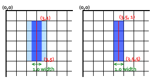
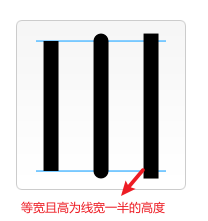
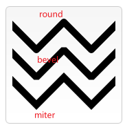
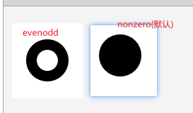
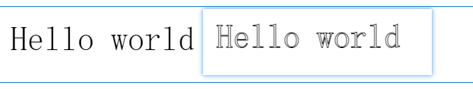

## CANVAS

### 1.绘制形状

#### 1.1 绘制路径

* beginPath() 新建一条路径

* closePath()  闭合路径

* stroke() 描边（空心）

* fill() 填充（闭合的实心）

* moveTo(x,y) 移动笔触，设置起点

* lineTo(x,y) 绘制一条从当前位置到指定xy的直线

* 虚线

  * getLineDash() 返回一个包含当前虚线样式，长度为非负偶数的数组。

  * setLineDash(segments) 设置当前虚线样式。

    segments = [线长，间隙]

  * lineDashOffset 设置虚线样式的起始偏移量。

  ````js
  var ctx = document.getElementById('canvas').getContext('2d');
  var offset = 0;
  
  function draw() {
    ctx.clearRect(0,0, canvas.width, canvas.height);
    ctx.setLineDash([4, 2]);
    ctx.lineDashOffset = -offset;
    ctx.strokeRect(10,10, 100, 100);
  }
  
  function march() {
    offset++;
    if (offset > 16) {
      offset = 0;
    }
    draw();
    setTimeout(march, 20);
  }
  
  march();
  ````

#### 1.2绘制矩形

* fillRect(x,y,width,height)  绘制一个填充的矩形
* strokeRect(x,y,width,height) 绘制一个矩形的边框
* clearRect(x,y,width,height) 清除指定矩形区域，让清除部分完全透明。
* rect(x,y,width,height) 直接将一个矩形路径增加到当前路径上

#### 1.3绘制圆弧

* arc(x,y,radius,startAngle,endAngle,anticlockwise)

  以(x,y）为圆心，radius为半径，从startAngle到endAngle结束的，anticlockwise(默认顺时针方向)的圆弧
  startAngle=弧度=(Math.PI/180)*角度

* arc(x1,y1,x2,y2,radius) 

  根据给定的控制点与半径画一段圆弧，再以直线连接两个控制点

#### 1.4二次贝塞尔曲线及三次贝塞尔曲线


### 2.添加样式和颜色

#### 2.1线型

* lineWidth=num  线宽

  注：线宽会平分坐标两侧

  

* lineCap 设置线条末端样式

  butt(默认),round,square

  

* lineJoin 设置线条与线条间结合处的样式

  round,bevel,miter(默认)

  

* miterLimit=num  设定外延交点与连接点的最大距离，若交点距离大于此值，连接效果变成bevel


#### 2.2颜色

* fillStyle  设置图形的填充颜色。
* strokeStyle 设置图形轮廓的颜色。

#### 2.3透明度

* globalAlpha

  它的有效范围是从 0.0（完全透明）到 1.0（完全不透明）。

#### 2.4阴影Shadows

* shadowOffsetX 与 shadowOffsetY

  设置阴影在X和Y轴的延伸距离：默认0，+向下向右，-向上向左

* shadowBlur

  设定阴影的模糊程度：默认0

* shadowColor

  设置阴影颜色，默认全透明的黑色

#### 2.5渐变 Gradients

* createLinearGradient(x1,y1,x2,y2)

* createRediaGradient(x1,y1,r1,x2,y2,r2)

* gradient.addColorStop(position,color) 

  postion:必须是一个 0.0 与 1.0 之间的数值，表示渐变中颜色所在的相对位置

#### 2.6canvas 填充规则

用到fill,clip,或isPositionPath可选择一个填充规则:

* nonzero (默认）
* evenodd

````js
function draw() {
  var ctx = document.getElementById('canvas').getContext('2d');
  ctx.beginPath();
  ctx.arc(50, 50, 30, 0, Math.PI*2, true);
  ctx.arc(50, 50, 15, 0, Math.PI*2, true);
  ctx.fill("evenodd");
}
````



### 3.绘制文本

* fillText(text,x,y,[,maxWidth])  实心字

  在指定的(x,y)位置填充指定的文本，绘制的最大宽度是可选的.

* strokeText(text,x,y,[,maxWidth])  空心字

  在指定的(x,y)位置绘制文本边框，绘制的最大宽度是可选的.

````js
function draw() {
  var ctx = document.getElementById('canvas').getContext('2d');
  ctx.font = "48px serif";
  ctx.fillText("Hello world", 10, 50);
  ctx.strokeText("Hello world", 10, 50);
}
````



文本属性

* font,textAlign,textBaselnie,direction,
* measureText()  返回一个体现文本特性属性的TextMetrics对象，

### 4.使用图像

````js
var img = new Image();   // 创建img元素
img.onload = function(){
  // 执行drawImage语句
}
// 避免报错，用onload事件保证不会在加载完毕前使用图片
img.src = 'myImage.png'; 
````

* drawImage(image,x,y)

  image是image或者canvas对象，(x,y)起始坐标

* drawImage(image,x,y,width,height)

  w,h控制向canvas画入时应该**缩放**的大小

* drawImage(image,sx,sy,sWidth,Sheight,dx,dy,dWidth,dHeight) **切片**

  前四个是图片源的切片位置和大小，后四个是切片放置的位置和大小

* 控制图片的缩放行为: imageSmoothingEnabled

  默认true，使用平滑算法


  ````js
  ctx.mozImageSmoothingEnabled = false;
  ctx.webkitImageSmoothingEnabled = false;
  ctx.msImageSmoothingEnabled = false;
  ctx.imageSmoothingEnabled = false;
  ````


### 5.变形 Transformations

* save() 保存cavas的所有状态
* restore() 恢复save()之前的状态

**移动**

* translate(x,y)

**旋转**

* rotate(angle) 顺时针

**缩放**

* scale(x,y)

**变形**

* transform(a,b,c,d,e,f)


### 6.合成与裁剪

### 7.基本的动画


